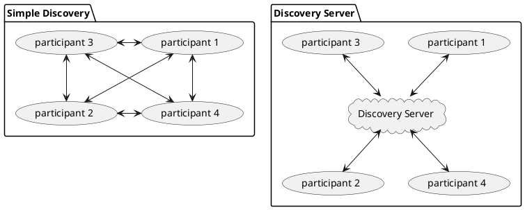

# eProsima Discovery Server

[Current standard](http://www.omg.org/spec/DDSI-RTPS/2.2) in its section 8.5 specifies a non-centralized, distributed simple discovery mechanism for RTPS. This mechanism was devised to allow interoperability among independent vendor specific implementations but is not expected to be optimal in every environment. There are several scenarios were the simple discovery mechanism is unsuitable or plainly cannot be applied:

- a high number of endpoint entities are continuously entering and exiting a large network.
- a network without multicasting capabilities.

In order to cope with the above issues the fast-RTPS discovery mechanism was extended with a client-server functionality. Besides, to simplify the management and testing of this new functionality a discovery-server application was devised. 

## Supported platforms

* Linux 
* Windows 

### **Table Of Contents**

[Installation](#installation)

[Usage](#usage)

[Example application](#example-application)

[Testing](#testing)

[Documentation](#documentation)

[Getting Help](#getting-help)

### **Installation**

In order to use discovery server its necessary have a compatible version of [fast RTPS](https://eprosima-fast-rtps.readthedocs.io/en/latest/) installed (over release 1.9.0). Fast RTPS dependencies as [tinyxml](https://github.com/leethomason/tinyxml2.git) must be accessible, either because Fast RTPS was build-installed defining THIRDPARTY=ON or because those libraries have been specifically installed.

The well known cross-platform tool [colcon](https://colcon.readthedocs.io/en/released/) was chosen to simplify installation of the several mutually dependent [CMake](https://cmake.org/cmake/help/latest/) projects. In order to use colcon, [python](https://www.python.org/) and [CMake](https://cmake.org/cmake/help/latest/) must be first installed as detailed in the corresponding hyperlinks.

The following repositories should be downloaded from github into a directory that henceforth would be called **SOURCES**:

+ eProsima/Fast-CDR:			https://github.com/eProsima/Fast-CDR.git			
	
+ eProsima/Fast-RTPS:			https://github.com/eProsima/Fast-RTPS.git			
	
+ eProsima/Discovery-Server:	https://github.com/eProsima/Discovery-Server.git	


We also assume that the user wants to keep the build, log and installation files in a separate directory called **[BUILD]**. If this is not the case, flag `--base-paths [SOURCES]` can be ignored in what follows.

#### **Linux**

Valid placeholders for the linux example may be:

| PLACEHOLDER	|             EXAMPLE PATHS				 |
|:--------------|:--------------------------------------:|
|[SOURCES] 	 	| /home/username/Documents/colcon_sources|
|[BUILD]  	 	| /home/username/Documents/colcon_build  |


1. Create directory **[BUILD]** where we want to keep the build, install and log compilation results. 
		
2. Compile using the colcon tool. Choose the build configuration by declaring CMAKE_BUILD_TYPE as Debug or Release. In this example we've chosen Debug:
		
		[BUILD]$ colcon build --base-paths [SOURCES] --packages-up-to discovery-server --cmake-args -DCOMPILE_EXAMPLES=ON -DCMAKE_BUILD_TYPE=Debug
			
3. In order to run the tests use the following command:

		[BUILD]$ colcon test --base-paths [SOURCES] --packages-select discovery-server	

	note that only the test matching the build (step 2) configuration would run.

4. To run the example navigate to directory **[BUILD]**/install/discovery-server/examples/HelloWorldExampleDS/bin. The configuration bash file located in the install folder must be first run in order to set the required environment variables:
			
		[BUILD]/install/discovery-server/examples/C++/HelloWorldExampleDS/bin$ . ../../../../../local_setup.bash
			
	in order to test the helloworld example open three terminals and run the above command. Then launch the application with different arguments:	
		
		[BUILD]/install/discovery-server/examples/HelloWorldExampleDS/bin$ ./HelloWorldExampleDS publisher
		[BUILD]/install/discovery-server/examples/HelloWorldExampleDS/bin$ ./HelloWorldExampleDS subscriber
		[BUILD]/install/discovery-server/examples/HelloWorldExampleDS/bin$ ./HelloWorldExampleDS server
		

#### **Windows**

Valid placeholders for the windows example may be:

| PLACEHOLDER	|             EXAMPLE PATHS			 		|
|:--------------|:-----------------------------------------:|
|[SOURCES] 	 	| C:\Users\username\Documents\colcon_sources|
|[BUILD]  	 	| C:\Users\username\Documents\colcon_build  |

1. Create directory **[BUILD]** where you want to keep the build, install and log compilation results. 

2. If your generator (compiler) of choice is Visual Studio, launch colcon from a visual studio console. Any console can be setup into a visual studio one by executing a batch file. For example in VS2017 is usually C:\Program Files (x86)\Microsoft Visual Studio\2017\Community\Common7\Tools\VsDevCmd.bat

3. Compile using the colcon tool. If you are using a multi-configuration generator like Visual Studio we recommend to build both in debug and release modes:
		
		[BUILD]> colcon build --base-paths [SOURCES] --packages-up-to discovery-server --cmake-args -DCOMPILE_EXAMPLES=ON -DCMAKE_BUILD_TYPE=Debug
		[BUILD]> colcon build --base-paths [SOURCES] --packages-up-to discovery-server --cmake-args -DCOMPILE_EXAMPLES=ON -DCMAKE_BUILD_TYPE=Release
		
	If you are using a single configuration tool just make above call with your configuration of choice.

4. In order to run the tests in a multi-configuration generator like Visual Studio use the following command:

		[BUILD]> colcon test --base-paths [SOURCES] --packages-select discovery-server --ctest-args -C Debug
		
	here --ctest-args allows you to specify the configuration (Debug or Release) of interest (names are case sensitive). If you are using a single configuration tool this flag has no effect, as only the test matching the build (step 3) configuration would run.
	
5. In order to run the example, navigate to directory **[BUILD]**\install\discovery-server\examples\HelloWorldExampleDS\bin and run the executable, running first the configuration bat file located within install folder in order to set required environment variables:
	
		[BUILD]\install\discovery-server\examples\C++\HelloWorldExampleDS\bin>..\..\..\..\..\local_setup.bat
	
	To test the helloworld example open three consoles, run the above bat file and launch the application with different arguments:	
	
		[BUILD]\install\discovery-server\examples\C++\HelloWorldExampleDS\bin> HelloWorldExampleDS publisher
		[BUILD]\install\discovery-server\examples\C++\HelloWorldExampleDS\bin> HelloWorldExampleDS subscriber
		[BUILD]\install\discovery-server\examples\C++\HelloWorldExampleDS\bin> HelloWorldExampleDS server
		
### **Usage**

Under the new client-server discovery paradigm, the metatraffic (message exchange among participants to identify each other) is centralized in one or several *server* participants (right figure), as opposed to simple discovery (left figure), where metatraffic is exchanged using a message broadcast mechanism like an IP multicast protocol.



Clients must be aware of how to reach the server, usually by specifying an IP address and a transport protocol like UDP or TCP. Servers don't need any beforehand knowledge of clients but we must specify where they should be reached, usually by specifying a listening IP address and transport protocol.

One of the design goals of the current implementation was to keep both the discovery messages structure and standard RTPS writer and reader behavior unchanged. In order to do so, clients must be aware of their server's `GuidPrefix`. `GuidPrefix` is the RTPS standard participant unique identifier (basically 12 octecs), and allows clients to assess whether they are receiving messages from the right server, as each standard RTPS message contains this piece of information. Note that server's IP address may not be a reliable server's identifier because several can be specified and multicast addresses are acceptable. In future implementations any other more convenient and non-standard identifier may substitute the `GuidPrefix` at the expense of adding non-standard members to the RTPS discovery messages structure. 

Several fast-RTPS configuration structures have been updated in order to deal with the new client-server discovery strategy. Note that the following elements belong exclusively to fast RTPS builtin discovery architecture and that the discovery server application just profits from the capabilities provided by fast RTPS library.

#### RTPSParticipantAttributes

+ a `GuidPrefix_t guidPrefix` member specifies server's identity.  This member has only significance if `discovery_config.discoveryProtocol` is **SERVER** or **BACKUP**. There is a `ReadguidPrefix` method to easily fill in this member from a string formatted like `"4D.49.47.55.45.4c.5f.42.41.52.52.4f"` (note that each octec must be a valid hexadecimal figure).

#### BuiltinAttributes

+ All discovery related info is gathered in a `DiscoverySettings discovery_config` member.

+ In order to receive client metatraffic, `metatrafficUnicastLocatorList` or `metatrafficMulticastLocatorList` must be populated with the addresses that were given to the clients.

#### DiscoverySettings

+ a `DiscoveryProtocol_t discoveryProtocol` specifies participant's discovery kind:
	- **SIMPLE** generates a standard participant with complete backward compatibility with any other RTPS implementation.
	- **CLIENT** generates a *client* participant, which relies on a server to be notified of other *clients* presence. This participant can create publishers and subscribers of any topic (static or dynamic) as ordinary participants do.
	- **SERVER** generates a *server* participant, which receives, manages and spreads its linked *clients* metatraffic assuring any single one is aware of the others. This participant can create publishers and subscribers of any topic (static or dynamic) as ordinary participants do. Servers can link to other servers in order to share its clients information.
	- **BACKUP** generates a *server* participant with additional functionality over **SERVER**. Specifically, it uses a database to backup its client information, so that if for whatever reason it disappears, it can be automatically restored and continue spreading metatraffic to late joiners. A **SERVER** in the same scenario ought to collect client information again, introducing a recovery delay.
	
+ a `RemoteServerList_t  m_DiscoveryServers` lists the servers linked to the participant. This member has only significance if `discoveryProtocol` is **CLIENT**, **SERVER** or **BACKUP**. This member elements are `RemoteServerAttributes` objects that identify each server and report where to reach it:
	- `GuidPrefix_t guidPrefix` is the RTPS unique identifier of the server participant we want to link to. There is a `ReadguidPrefix` method to easily fill in this member from a string formatted like `"4D.49.47.55.45.4c.5f.42.41.52.52.4f"` (note that each octec must be a valid hexadecimal figure).
	- `metatrafficUnicastLocatorList` and `metatrafficMulticastLocatorList` are ordinary `LocatorList_t` (see fast-RTPS documentation) where server's locators must be specified. At least one of them should be populated.
	- `Duration_t discoveryServer_client_syncperiod` specifies the time span between PDP metatraffic exchange, and has only significance if `discoveryProtocol` is **CLIENT**, **SERVER** or **BACKUP**. The default value is half a second.
	
#### fast-RTPS XML schema (*fastRTPS_profiles.xsd*)

Each of the attributes in fast-RTPS has an echo in the XML profiles. XML profiles make it possible to avoid tiresome hard-coded settings within applications sources using XML configuration files. The fast XML schema was duly updated to accommodate the new client-server attributes:

+  The participant profile **rtps** tag contains a new optional **prefix** tag where the server `GuidPrefix_t` must be specified. Any other discovery selection as simple or clients may disregard this member.

+ The participant profile **builtin** tag contains a **discovery_config** tag where all discovery related info is gathered. This new tag contains the following new elements:
	- a **discoveryProtocol** tag, where the discovery type can be specified through the `DiscoveryProtocol_t` enumeration.
	- a **discoveryServersList** tag, where the server or servers linked with a participant can be specified.
	- a **clientAnnouncementPeriod** tag, where the time span between PDP metatraffic exchange can be specified.
	
Below we provide an example xml participant profile using this new *tags*:
	
```
<participant profile_name="UDP client" >
  <rtps>
	<builtin>
		<discovery_config>
		  <discoveryProtocol>CLIENT</discoveryProtocol>
		  <discoveryServersList>
			<RemoteServer prefix="4D.49.47.55.45.4c.5f.42.41.52.52.4f">
			  <metatrafficUnicastLocatorList>
				<locator>
				  <udpv4>
					<address>127.0.0.1</address>
					<port>64863</port>
				  </udpv4>
				</locator>
			  </metatrafficUnicastLocatorList>
			</RemoteServer>
		  </discoveryServersList>
		</discovery_config>
	</builtin>
  </rtps>
</participant>

<participant profile_name="UDP server">
  <rtps>
	<prefix>
	  4D.49.47.55.45.4c.5f.42.41.52.52.4f
	</prefix>
	<builtin>
		<discovery_config>
		  <discoveryProtocol>SERVER</discoveryProtocol>
		</discovery_config>
		<metatrafficUnicastLocatorList>
			<locator>
				<udpv4>
					<address>127.0.0.1</address>
					<port>64863</port>
				</udpv4>
			</locator>
		</metatrafficUnicastLocatorList>
	</builtin>        
  </rtps>
</participant>
```
### **Example application**

The fast-RTPS **HelloWorldExample** has been updated to illustrate the client-server functionality. Its installation details are explained in section [Installation](#installation) above. Basically, the publisher and subscriber participants are now *clients* and can only discover each other when a *server* participant is created. 

As usual, we launch publishers and subscribers by running HelloWorldExampleDS.exe with the corresponding **publisher** or **subscriber** argument. Each publisher and subscriber is launched within its own participant, but now the HelloWorldPublisher::init() and HelloWorldSubscriber::init() methods are modified to create clients and hard code the server reference.

#### UDP transport attribute settings

In order to use UDP we can rely in the default transport where the locators are actual ports and IP addresses.

##### UDP transport code setup for a client

```
    RemoteServerAttributes ratt;
    ratt.ReadguidPrefix("4D.49.47.55.45.4c.5f.42.41.52.52.4f");

    ParticipantAttributes PParam;
    PParam.rtps.builtin.discovery_config.discoveryProtocol = DiscoveryProtocol_t::CLIENT;
    PParam.rtps.builtin.domainId = 0;
    PParam.rtps.builtin.discovery_config.leaseDuration = c_TimeInfinite;
    PParam.rtps.setName("Participant_pub");
	
	Locator_t server_address(LOCATOR_KIND_UDPv4, 65215);
    IPLocator::setIPv4(server_address, 127, 0, 0, 1);

    ratt.metatrafficUnicastLocatorList.push_back(server_address);
    PParam.rtps.builtin.discovery_config.m_DiscoveryServers.push_back(ratt);
	
	mp_participant = Domain::createParticipant(PParam);
```

Note that according with [former attributes explanation](#rtpsparticipantattributes) we must populate the **DiscoverySettings discovery_config** specifying we want to create a **DiscoveryProtocol_t::CLIENT** and adding a new *RemoteServerAttributes* object to the *m_DiscoveryServers* list. In this case the UDP port 65215 is hardcoded as is the server prefix.

##### UDP transport code setup for a server

```
    ParticipantAttributes PParam;
    PParam.rtps.builtin.discovery_config.discoveryProtocol = DiscoveryProtocol_t::SERVER;
    PParam.rtps.ReadguidPrefix("4D.49.47.55.45.4c.5f.42.41.52.52.4f");
    PParam.rtps.builtin.domainId = 0;
    PParam.rtps.builtin.discovery_config.leaseDuration = c_TimeInfinite;
    PParam.rtps.setName("Participant_server");
	
	Locator_t server_address(LOCATOR_KIND_UDPv4, 65215);
    IPLocator::setIPv4(server_address, 127, 0, 0, 1);

    PParam.rtps.builtin.metatrafficUnicastLocatorList.push_back(server_address);
	
	mp_participant = Domain::createParticipant(PParam);
```
Note that according with [former attributes explanation](#rtpsparticipantattributes) we must populate the **DiscoverySettings discovery_config** specifying we want to create a **DiscoveryProtocol_t::SERVER** and adding a new listening locator to any **BuiltinAttributes** metatraffic lists (this locator or locators must be known by the clients). In this case the UDP port 65215 is hardcoded as is the server prefix.

#### TCP transport attribute settings

For TCP transport is mandatory to disable the default transport setting the **RTPSParticipantAttributes::useBuiltinTransports** as false and creating a new *transport descriptor* thus fast RTPS framework might create a suitable transport object.

##### TCP transport code setup for a client

```
    RemoteServerAttributes ratt;
    ratt.ReadguidPrefix("4D.49.47.55.45.4c.5f.42.41.52.52.4f");

    ParticipantAttributes PParam;
    PParam.rtps.builtin.discovery_config.discoveryProtocol = DiscoveryProtocol_t::CLIENT;
    PParam.rtps.builtin.domainId = 0;
    PParam.rtps.builtin.discovery_config.leaseDuration = c_TimeInfinite;
    PParam.rtps.setName("Participant_pub");
	
	Locator_t server_address; 
	server_address.kind = LOCATOR_KIND_TCPv4;
	IPLocator::setLogicalPort(server_address, 65215);
	IPLocator::setPhysicalPort(server_address, 9843); 
	IPLocator::setIPv4(server_address, 127, 0, 0, 1);

	ratt.metatrafficUnicastLocatorList.push_back(server_address);
	PParam.rtps.builtin.discovery_config.m_DiscoveryServers.push_back(ratt);

	PParam.rtps.useBuiltinTransports = false;
	std::shared_ptr<TCPv4TransportDescriptor> descriptor = std::make_shared<TCPv4TransportDescriptor>();

	// Generate a listening port for the client
	std::default_random_engine gen(System::GetPID());
	std::uniform_int_distribution<int> rdn(49152, 65535);
	descriptor->add_listener_port(rdn(gen)); // IANA ephemeral port number

	descriptor->wait_for_tcp_negotiation = false;
	PParam.rtps.userTransports.push_back(descriptor);

	mp_participant = Domain::createParticipant(PParam);
``` 

The **DiscoverySettings discovery_config** is almost the same as in [analogous UDP case](#udp-transport-code-setup-for-a-client).  Note that here the *server_address* locator specifies 65215 as a logical port and 9843 as a physical one. The reason behind this is that TCP transport was devised in order to allow a single TCP connection tunnel several participants traffic through it. In order to differenciate each participant sharing the connection a *logical port concept* was introduced. The transport will understand that must connect to the physical port (using TCP protocol) and rely meta traffic to the logical port 65215 which is the meta traffic mailbox of the server we are interested in.

A new TCPv4TransportDescriptor must be created and a physical listening port selected. In this case each HelloWorldExample instance creates a single participant thus the linked proccess ID is a suitable seed to make up a listening port number (this way each time a new client is created a different port is selected).

##### TCP transport code setup for a server

```
    ParticipantAttributes PParam;
    PParam.rtps.builtin.discovery_config.discoveryProtocol = DiscoveryProtocol_t::SERVER;
    PParam.rtps.ReadguidPrefix("4D.49.47.55.45.4c.5f.42.41.52.52.4f");
    PParam.rtps.builtin.domainId = 0;
    PParam.rtps.builtin.discovery_config.leaseDuration = c_TimeInfinite;
    PParam.rtps.setName("Participant_server");
	
	Locator_t server_address; 
	server_address.kind = LOCATOR_KIND_TCPv4;
	IPLocator::setLogicalPort(server_address, 65215);
	IPLocator::setIPv4(server_address, 127, 0, 0, 1);

	PParam.rtps.builtin.metatrafficUnicastLocatorList.push_back(server_address);

	std::shared_ptr<TCPv4TransportDescriptor> descriptor = std::make_shared<TCPv4TransportDescriptor>();
	descriptor->wait_for_tcp_negotiation = false;
	descriptor->add_listener_port(9843);

	PParam.rtps.useBuiltinTransports = false;
	PParam.rtps.userTransports.push_back(descriptor);
	
	mp_participant = Domain::createParticipant(PParam);
```

The **DiscoverySettings discovery_config** is almost the same as in [analogous UDP case](#udp-transport-code-setup-for-a-server). Note that here the *server_address* locator specifies 65215 as a logical port instead of a physical one. 

A new TCPv4TransportDescriptor must be created and a physical listening port selected. Unlike the client code this listening port (9843 in the example) must be known beforehand for all clients in order to successfully deliver meta traffic to the server. 

###HelloWorldExample command line

Assuming the current directory is the example binary one, the execution steps would be:

+ Windows:
	
	Console 1:
	
		>..\..\..\..\..\local_setup.bat
		> HelloWorldExampleDS publisher
	
	Console 2:
	
		>..\..\..\..\..\local_setup.bat
		> HelloWorldExampleDS subscriber
	
	Console 3:
	
		>..\..\..\..\..\local_setup.bat
		> HelloWorldExampleDS server
		
+ Linux:

	Terminal 1:
	
		$ . ../../../../../local_setup.bash
		$ ./HelloWorldExampleDS publisher
		
	Terminal 2:
	
		$ . ../../../../../local_setup.bash
		$ ./HelloWorldExampleDS subscriber	

	Terminal 3:
	
		$ . ../../../../../local_setup.bash
		$ ./HelloWorldExampleDS server	
		
Information exchange between publisher and subscriber should take place when the server begins running.
		
### **Testing**

Discovery testing is done resorting to discover-server config files. Each test uses a specific XML file that tests a single or several discovery features. To automatically launch the tests using colcon, please check section [Installation](#installation). To manually launch a test, use the following procedure:

Linux:
	
	[BUILD]/install/discovery-server/bin$ . ../../local_setup.bash
	[BUILD]/install/discovery-server/bin$ ./discovery-server-X.Y.Z(d) [SOURCES]/discovery-server/resources/xml/test_XXX.xml

Windows:

	[BUILD]\install\discovery-server\bin>..\..\local_setup.bat
	[BUILD]\install\discovery-server\bin>discovery-server-X.Y.Z(d) [SOURCES]\discovery-server\resources\xml\test_XXX.xml
	
To view the full discovery information messages and snapshots in debug configuration, run colcon with the additional flag `-DLOG_LEVEL_INFO=1`.
	
A brief description of each test is given below. Note that a detailed explanation of the XML syntax is given in section [Documentation](#documentation).

#### test_1_PDP_UDP.xml

This is the most simple scenario: a single server manages the discovery information of four clients. The server prefix and listening ports are given in the profiles **UDP server** and **UDP client**. A snapshot is taken after 3 seconds to assess that all clients are aware of the existence of each other.

```
 <servers>
    <server name="server" profile_name="UDP server" />
  </servers>

  <clients>
    <client name="client1" profile_name="UDP client"/>
    <client name="client2" profile_name="UDP client"/>
    <client name="client3" profile_name="UDP client"/>
    <client name="client4" profile_name="UDP client"/>
  </clients>

  <snapshots>
    <snapshot time="3">Check all clients met the server and know each other</snapshot>
  </snapshots>
```
The snapshot information output would be something like:

```
2019-04-24 12:58:36.936 [DISCOVERY_SERVER Info] Snapshot taken at 2019-04-24 12:58:36 description: Check all clients met the server and know each other
5 participants report the following discovery info:
Participant 1.f.1.30.ac.12.0.0.2.0.0.0|0.0.1.c1 discovered:
         Participant client2 1.f.1.30.ac.12.0.0.3.0.0.0|0.0.1.c1
         Participant client3 1.f.1.30.ac.12.0.0.4.0.0.0|0.0.1.c1
         Participant client4 1.f.1.30.ac.12.0.0.5.0.0.0|0.0.1.c1
         Participant server 4d.49.47.55.45.4c.5f.42.41.52.52.4f|0.0.1.c1

Participant 1.f.1.30.ac.12.0.0.3.0.0.0|0.0.1.c1 discovered:
         Participant client1 1.f.1.30.ac.12.0.0.2.0.0.0|0.0.1.c1
         Participant client3 1.f.1.30.ac.12.0.0.4.0.0.0|0.0.1.c1
         Participant client4 1.f.1.30.ac.12.0.0.5.0.0.0|0.0.1.c1
         Participant server 4d.49.47.55.45.4c.5f.42.41.52.52.4f|0.0.1.c1

Participant 1.f.1.30.ac.12.0.0.4.0.0.0|0.0.1.c1 discovered:
         Participant client1 1.f.1.30.ac.12.0.0.2.0.0.0|0.0.1.c1
         Participant client2 1.f.1.30.ac.12.0.0.3.0.0.0|0.0.1.c1
         Participant client4 1.f.1.30.ac.12.0.0.5.0.0.0|0.0.1.c1
         Participant server 4d.49.47.55.45.4c.5f.42.41.52.52.4f|0.0.1.c1

Participant 1.f.1.30.ac.12.0.0.5.0.0.0|0.0.1.c1 discovered:
         Participant client1 1.f.1.30.ac.12.0.0.2.0.0.0|0.0.1.c1
         Participant client2 1.f.1.30.ac.12.0.0.3.0.0.0|0.0.1.c1
         Participant client3 1.f.1.30.ac.12.0.0.4.0.0.0|0.0.1.c1
         Participant server 4d.49.47.55.45.4c.5f.42.41.52.52.4f|0.0.1.c1

Participant 4d.49.47.55.45.4c.5f.42.41.52.52.4f|0.0.1.c1 discovered:
         Participant client1 1.f.1.30.ac.12.0.0.2.0.0.0|0.0.1.c1
         Participant client2 1.f.1.30.ac.12.0.0.3.0.0.0|0.0.1.c1
         Participant client3 1.f.1.30.ac.12.0.0.4.0.0.0|0.0.1.c1
         Participant client4 1.f.1.30.ac.12.0.0.5.0.0.0|0.0.1.c1
```

Here we see how all participants reported the discovery of all the others. Note that, because there is no fast-RTPS discovery callback from a participant to report its own discovery, participants do not report themselves. This must be taken into account when a snapshot is checked. Note, however, that participants do discover themselves when they create a publisher or subscriber, because there are callbacks associated for those cases.

### test_2_PDP_TCP.xml

 Resembles the previous scenario but uses TCP transport instead of the default UDP one. A single server manages the discovery info of four clients. The server prefix and listening ports are given in the profiles **TCP server** and **TCP client**. A snapshot is taken after 3 seconds to assess that all clients are aware of the existence of each other.
 
 Specific transport descriptor must be created for server and clients:
 
```
<transport_descriptors>
  
  <transport_descriptor>
	<transport_id>TCPv4_SERVER</transport_id>
	<type>TCPv4</type>
	<listening_ports>
	  <port>65215</port>
	</listening_ports>
	<calculate_crc>false</calculate_crc>
	<check_crc>false</check_crc>
  </transport_descriptor>

  <transport_descriptor>
	<transport_id>TCPv4_CLIENT</transport_id>
	<type>TCPv4</type>
	<calculate_crc>false</calculate_crc>
	<check_crc>false</check_crc>
  </transport_descriptor>
  
</transport_descriptors>
```
 
 Client and server participant profiles must reference this transport and discard builtin ones.
 
```
<participant profile_name="TCP client" >
  <rtps>
	<userTransports>
	  <transport_id>TCPv4_CLIENT</transport_id>
	</userTransports>
	<useBuiltinTransports>false</useBuiltinTransports>
	...
  </rtps>
</participant>

<participant profile_name="TCP server" >
  <rtps>
	....
	<userTransports>
	  <transport_id>TCPv4_SERVER</transport_id>
	</userTransports>
	<useBuiltinTransports>false</useBuiltinTransports>
	...
  </rtps>
</participant>
```

This test is currently disabled because the fast-RTPS commit discovery-server is based upon was undergoing TCP transport refactoring. The test will be enabled when this fast-RTPS branch merges with the updated version of fast.
 

#### test_3_PDP_UDP.xml

Here we test the discovery capacity of handling late joiners. A single server is created, which manages the discovery information of four clients with different lifespans. The server prefix and listening ports are given in the profiles **UDP server** and **UDP client**. A snapshot is taken whenever there is a participant creation or removal to assess all entities are aware of it.

```
  <servers>
    <server name="server" profile_name="UDP server" />
  </servers>

  <clients>
    <client name="client1" profile_name="UDP client" removal_time="8"/>
    <client name="client2" profile_name="UDP client" creation_time="2" removal_time="10" />
    <client name="client3" profile_name="UDP client" creation_time="4" removal_time="12" />
    <client name="client4" profile_name="UDP client" creation_time="6" removal_time="14" />
  </clients>

  <snapshots>
    <snapshot time="1">Check server and client1 known each other</snapshot>
	  <snapshot time="3">Check server and client1 acknowledge client2 creation</snapshot>
	  <snapshot time="5">Check server, client1 and client2 acknowledge client3 creation</snapshot>
	  <snapshot time="7">Check server, client1, client2 and client3 acknowledge client4 creation</snapshot>
	  <snapshot time="9">Check client1 removal is acknowledge by all remaining</snapshot>
	  <snapshot time="11">Check client2 removal is acknowledge by all remaining</snapshot>
	  <snapshot time="13">Check client3 removal is acknowledge by all remaining</snapshot>
	  <snapshot time="15">Check client4 removal is acknowledge by all remaining</snapshot>
  </snapshots>
```
 
#### test_4_PDP_UDP.xml

Here we test the capability of one server to exchange information with another one. Two servers are created and each one has two associated clients. We take a snapshot to assess all clients are aware of the other server's clients existence. Note that we don't need to modify the previous tests profiles, as we can rely on *server* and *client* tag attributes to avoid create redundant boilerplate profiles:

	- *server* **prefix** attribute is used to superseed the profile specified one, and uniquely identifies each server.
	- *server* **ListeningPorts** and **ServerList** tags allow us to link servers between them without creating specific server profiles.
	- *client* **server** attribute is used to link a client with its server without using a new profile or a **ServerList**.
	
```
  <servers>
    <server name="server1" prefix="4D.49.47.55.45.4c.5f.42.41.52.52.4f" profile_name="UDP server" />
	<server name="server2" prefix="4D.49.47.55.45.4c.7e.42.41.52.52.4f" profile_name="UDP server">
	  <ListeningPorts>
        <metatrafficUnicastLocatorList>
          <locator>
            <udpv4>
              <address>127.0.0.1</address>
              <port>65221</port>
            </udpv4>
          </locator>
        </metatrafficUnicastLocatorList>
      </ListeningPorts>
      <ServersList>
        <RServer prefix="4D.49.47.55.45.4c.5f.42.41.52.52.4f" />
      </ServersList>	
	</server>
  </servers>

  <clients>
    <client name="client1" profile_name="UDP client" server="4D.49.47.55.45.4c.5f.42.41.52.52.4f"/>
    <client name="client2" profile_name="UDP client" server="4D.49.47.55.45.4c.7e.42.41.52.52.4f" />
    <client name="client3" profile_name="UDP client" server="4D.49.47.55.45.4c.7e.42.41.52.52.4f" />
    <client name="client4" profile_name="UDP client" server="4D.49.47.55.45.4c.7e.42.41.52.52.4f" />
  </clients>

  <snapshots>
    <snapshot time="3">Check all clients known each other</snapshot>
  </snapshots>
```	

#### test_5_EDP_UDP.xml

This test introduces dummy publishers and subscribers to assess proper EDP discovery operation. A server and two clients are created, and each participant (server included) creates publishers and subscribers with different types and topics. At the end a snapshot is taken to verify all publishers and subscribers have been reported by all participants. Note that the tags *publisher* and *subscriber* have attributes to superseed topics specified in profiles.

```
  <servers>
    <server name="server" profile_name="UDP server">
	  <subscriber topic="topic 1" />
      <publisher topic="topic 2" />
	</server>
  </servers>

  <clients>
    <client name="client1" profile_name="UDP client">
	    <subscriber /> <!-- defaults to helloworld type -->
	    <subscriber topic="topic 2" />
	    <subscriber profile_name="Sub 1" />
	    <publisher profile_name="Pub 2" />	
	</client>
    <client name="client2" profile_name="UDP client">
	    <publisher />  <!-- defaults to helloworld type -->
		<publisher topic="topic 1" />
		<publisher profile_name="Pub 1" />
		<subscriber profile_name="Sub 2" />
	</client>
  </clients>

  <snapshots>
    <snapshot time="3">Check all publishers and subscribers are properly discovered by everybody</snapshot>
  </snapshots>
```
Snapshots with EDP information are more verbose:

```
2019-04-24 14:52:44.300 [DISCOVERY_SERVER Info] Snapshot taken at 2019-04-24 14:52:44 description: Check all publishers and subscribers are properly discovered by everybody
3 participants report the following discovery info:
Participant 1.f.1.30.64.47.0.0.2.0.0.0|0.0.1.c1 discovered: 
	 Participant 1.f.1.30.64.47.0.0.2.0.0.0|0.0.1.c1 has:
		1 publishers:
			Publisher 1.f.1.30.64.47.0.0.2.0.0.0|0.0.1.3 TypeName: sample_type_2 TopicName: topic_2
		3 subscribers:
			Subscriber 1.f.1.30.64.47.0.0.2.0.0.0|0.0.2.4 TypeName: HelloWorld TopicName: HelloWorldTopic
			Subscriber 1.f.1.30.64.47.0.0.2.0.0.0|0.0.3.4 TypeName: sample_type_2 TopicName: topic_2
			Subscriber 1.f.1.30.64.47.0.0.2.0.0.0|0.0.4.4 TypeName: sample_type_1 TopicName: topic_1

	 Participant client2 1.f.1.30.64.47.0.0.3.0.0.0|0.0.1.c1 has:
		3 publishers:
			Publisher 1.f.1.30.64.47.0.0.3.0.0.0|0.0.1.3 TypeName: HelloWorld TopicName: HelloWorldTopic
			Publisher 1.f.1.30.64.47.0.0.3.0.0.0|0.0.2.3 TypeName: sample_type_1 TopicName: topic_1
			Publisher 1.f.1.30.64.47.0.0.3.0.0.0|0.0.3.3 TypeName: sample_type_1 TopicName: topic_1
		1 subscribers:
			Subscriber 1.f.1.30.64.47.0.0.3.0.0.0|0.0.4.4 TypeName: sample_type_2 TopicName: topic_2

	 Participant server 4d.49.47.55.45.4c.5f.42.41.52.52.4f|0.0.1.c1 has:
		1 publishers:
			Publisher 4d.49.47.55.45.4c.5f.42.41.52.52.4f|0.0.1.3 TypeName: sample_type_2 TopicName: topic_2
		1 subscribers:
			Subscriber 4d.49.47.55.45.4c.5f.42.41.52.52.4f|0.0.2.4 TypeName: sample_type_1 TopicName: topic_1


Participant 1.f.1.30.64.47.0.0.3.0.0.0|0.0.1.c1 discovered: 
	 Participant client1 1.f.1.30.64.47.0.0.2.0.0.0|0.0.1.c1 has:
		1 publishers:
			Publisher 1.f.1.30.64.47.0.0.2.0.0.0|0.0.1.3 TypeName: sample_type_2 TopicName: topic_2
		3 subscribers:
			Subscriber 1.f.1.30.64.47.0.0.2.0.0.0|0.0.2.4 TypeName: HelloWorld TopicName: HelloWorldTopic
			Subscriber 1.f.1.30.64.47.0.0.2.0.0.0|0.0.3.4 TypeName: sample_type_2 TopicName: topic_2
			Subscriber 1.f.1.30.64.47.0.0.2.0.0.0|0.0.4.4 TypeName: sample_type_1 TopicName: topic_1

	 Participant 1.f.1.30.64.47.0.0.3.0.0.0|0.0.1.c1 has:
		3 publishers:
			Publisher 1.f.1.30.64.47.0.0.3.0.0.0|0.0.1.3 TypeName: HelloWorld TopicName: HelloWorldTopic
			Publisher 1.f.1.30.64.47.0.0.3.0.0.0|0.0.2.3 TypeName: sample_type_1 TopicName: topic_1
			Publisher 1.f.1.30.64.47.0.0.3.0.0.0|0.0.3.3 TypeName: sample_type_1 TopicName: topic_1
		1 subscribers:
			Subscriber 1.f.1.30.64.47.0.0.3.0.0.0|0.0.4.4 TypeName: sample_type_2 TopicName: topic_2

	 Participant server 4d.49.47.55.45.4c.5f.42.41.52.52.4f|0.0.1.c1 has:
		1 publishers:
			Publisher 4d.49.47.55.45.4c.5f.42.41.52.52.4f|0.0.1.3 TypeName: sample_type_2 TopicName: topic_2
		1 subscribers:
			Subscriber 4d.49.47.55.45.4c.5f.42.41.52.52.4f|0.0.2.4 TypeName: sample_type_1 TopicName: topic_1


Participant 4d.49.47.55.45.4c.5f.42.41.52.52.4f|0.0.1.c1 discovered: 
	 Participant client1 1.f.1.30.64.47.0.0.2.0.0.0|0.0.1.c1 has:
		1 publishers:
			Publisher 1.f.1.30.64.47.0.0.2.0.0.0|0.0.1.3 TypeName: sample_type_2 TopicName: topic_2
		3 subscribers:
			Subscriber 1.f.1.30.64.47.0.0.2.0.0.0|0.0.2.4 TypeName: HelloWorld TopicName: HelloWorldTopic
			Subscriber 1.f.1.30.64.47.0.0.2.0.0.0|0.0.3.4 TypeName: sample_type_2 TopicName: topic_2
			Subscriber 1.f.1.30.64.47.0.0.2.0.0.0|0.0.4.4 TypeName: sample_type_1 TopicName: topic_1

	 Participant client2 1.f.1.30.64.47.0.0.3.0.0.0|0.0.1.c1 has:
		3 publishers:
			Publisher 1.f.1.30.64.47.0.0.3.0.0.0|0.0.1.3 TypeName: HelloWorld TopicName: HelloWorldTopic
			Publisher 1.f.1.30.64.47.0.0.3.0.0.0|0.0.2.3 TypeName: sample_type_1 TopicName: topic_1
			Publisher 1.f.1.30.64.47.0.0.3.0.0.0|0.0.3.3 TypeName: sample_type_1 TopicName: topic_1
		1 subscribers:
			Subscriber 1.f.1.30.64.47.0.0.3.0.0.0|0.0.4.4 TypeName: sample_type_2 TopicName: topic_2

	 Participant 4d.49.47.55.45.4c.5f.42.41.52.52.4f|0.0.1.c1 has:
		1 publishers:
			Publisher 4d.49.47.55.45.4c.5f.42.41.52.52.4f|0.0.1.3 TypeName: sample_type_2 TopicName: topic_2
		1 subscribers:
			Subscriber 4d.49.47.55.45.4c.5f.42.41.52.52.4f|0.0.2.4 TypeName: sample_type_1 TopicName: topic_1
```

#### test_6_EDP_UDP.xml

Here we test how the discover handles EDP late joiners. It's the same scenario with a server and two clients with different lifespans. Each participant (server included) creates publishers and subscribers with different lifespans, types and topics. Snapshots are taken whenever an enpoint is created or destroyed to assess every participant shares the same discovery info.

```
  <servers>
    <server name="server" profile_name="UDP server" creation_time="1" >
	  <subscriber topic="topic 1" creation_time="3" />
      <publisher topic="topic 2" creation_time="5" />
	</server>
  </servers>

  <clients>
    <client name="client1" profile_name="UDP client" removal="16">
	  <subscriber creation_time="7" removal_time="14" /> <!-- defaults to helloworld type -->
	  <subscriber topic="topic 2" creation_time="7" removal_time="14" />
	  <subscriber profile_name="Sub 1" creation_time="7" removal_time="14" />
	  <publisher profile_name="Pub 2" creation_time="12" />	
	</client>
    <client name="client2" profile_name="UDP client" creation_time="9">
	  <publisher creation_time="10" />  <!-- defaults to helloworld type -->
      <publisher topic="topic 1" creation_time="10" />
      <publisher profile_name="Pub 1" creation_time="10" />
      <subscriber profile_name="Sub 2" creation_time="10" />
	</client>
  </clients>

  <snapshots>
	  <snapshot time="2">Check client1 detects the server</snapshot>
	  <snapshot time="4">Check client1 detects server's subscriber</snapshot>
	  <snapshot time="6">Check client1 detects server's publisher</snapshot>
	  <snapshot time="8">Check server detects client1's subscribers</snapshot>
	  <snapshot time="11">Check server and client1 detects client2's and its entities</snapshot>
	  <snapshot time="13">Check everybody detects new client1's publisher</snapshot>
	  <snapshot time="15">Check everybody detects client1's subscribers' removal</snapshot>
	  <snapshot time="17">Check  server and client2 detects client1 removal</snapshot>
  </snapshots>
```

### **Documentation**

Using the client-server discovery directly from the fast-RTPS library is possible, as shown in section [Usage](#Usage), but is far more convenient to use the **discovery-server** application, specially for testing purposes.

If the colcon deployment strategy described in section [Installation](#installation) was followed, the discovery-server binary can be executed as:

Linux:
	
	[BUILD]/install/discovery-server/bin$ . ../../local_setup.bash
	[BUILD]/install/discovery-server/bin$ ./discovery-server-1.0.0 config_file.xml

Windows:

	[BUILD]\install\discovery-server\bin>..\..\local_setup.bat
	[BUILD]\install\discovery-server\bin>discovery-server-1.0.0 config_file.xml
	
where:
- the local_setup batch sets up the environment variables for the binary execution.
- the discovery-server binary name depends on build configuration (debug introduces d postfix) an version number.
- the config_file.xml is a placeholder for any xml config file that follows the **discovery-server.xsd**.
	
#### Discovery server config files

Discovery-server operation is managed from a XML config file that follows the **discovery-server.xsd** schema located in **[SOURCES]**/discovery-server/resources/xsd (this is an extension of the fast-RTPS xml schema). The discovery-server main goals is:

- Simplify the configuration of fast-RTPS servers. Using a fast-RTPS participant profile for each server is tiresome, given the large number of boilerplate code to move around. New XML syntax extensions are introduced to ease this task.

- Provide a flexible testing tool for the client-server discovery implementation. Testing the discovery involves creating large number of participants, publishers, subscribers that use specific topics and types (static or dynamic ones) over different transports. Besides all these entities may appear or disappear at different times, and we need to be able to check the discovery status (collective participant knowledge) at any of these times.

The outermost XML tag is **DS**. It admits an optional boolean attribute called **user_shutdown** that defaults to *true*. By default the discover-server binary runs indefinitely until the user decides to shutdown. This default behavior is suitable for practical applications but not for testing. Test XML files use `user_shutdown="false"`, which grants that the discovery server is closed as soon as the test is fulfilled. The **DS** tag can contain the following tags:

+ **profiles** is plainly the fast-RTPS profiles. We can use them to fine tune the server operation. The associated documentation can be found [here](https://eprosima-fast-rtps.readthedocs.io/en/latest/xmlprofiles.html), note the updates introduced in section [Usage](#usage).

+ **servers** is a list of servers that the discovery-server must create and setup. Must contain at least a **server** tag. Each server admits the following attributes:
	- **name** non mandatory but advisable for debugging purposes.
	- **prefix** server unique identifier. It's optional because it may be specified in the profile but using this attribute we can avoid generate server profiles that only differ in prefix.
	- **profile_name** identifies the profile associated with this server is a mandatory one.
	- **persist** specifies if the participant is a [**SERVER**](#builtinattributes) or a [**BACKUP**](#builtinattributes).
	- **creation_time** introduced for testing purposes specifies in seconds when a server must be created.
	- **removal_time** introduced for testing purposes specifies in seconds when a server must be destroyed.
	
	Each server element admits the following tags:
	- **ListeningPorts** contains lists of locators where this server will listen for incoming client metatraffic.
	- **ServersList** contains at least one **RServer** tag that references the servers this one wants to link to.  **RServer** only has a prefix attribute. Based on this prefix the discover-server parser would search for the corresponding server locators within the config file.
	- **publisher** introduced for testing purposes. Creates a dummy publisher characterized by *profile_name*, *topic*, *creation_time* and *removal_time*.
	- **subscriber** introduced for testing purposes. Creates a dummy publisher characterized by *profile_name*, *topic*, *creation_time* and *removal_time*.

+ **clients** introduced for testing purposes. Is a list of dummy clients that the discovery-server must create and setup. Must contain at least a **client** tag. Each client admits the following attributes:
	- **name** non mandatory but advisable for debugging purposes.
	- **profile_name** identifies the profile associated with this server is a mandatory one.
	- **server** specifies the prefix of the server we want to link to. This optional attribute saves us the nuisance of creating a **ServerList** (only if this client references a single server). Based on this prefix the discover-server parser would search for the corresponding server locators within the config file. 
	 - **listening_port** specifies a physical port where to listen for incomming traffic. This attribute is mandatory in TCP transport (client wouldn't receive other clients traffic without it). When using the TCPv4 the format is: [XXX.XXX.XXX.XXX:]XXXX where the IP address is the client's WAN address that must be specified if we want the client to be reachable from outside a local NAT.
	- **creation_time** introduced for testing purposes specifies in seconds when a client must be created.
	- **removal_time** introduced for testing purposes specifies in seconds when a client must be destroyed.
	
	Each client element admits the following tags:
	- **ServersList** contains at least one **RServer** tag that references the servers this one wants to link to.  **RServer** only has a prefix attribute. Based on this prefix the discover-server parser would search for the corresponding server locators within the config file.
	- **publisher** introduced for testing purposes. Creates a publisher characterized by *profile_name*, *topic*, *creation_time* and *removal_time*.
	- **subscriber** introduced for testing purposes. Creates a publisher characterized by *profile_name*, *topic*, *creation_time* and *removal_time*.

+ **types** is plainly the fast-RTPS types. It's introduced here for testing purposes to check how topic and type discovery info is handled by EDP. The associated documentation can be found [here](https://eprosima-fast-rtps.readthedocs.io/en/latest/xmlprofiles.html#xml-dynamic-types).

+ **snapshots** contains **snapshot** tags. Whenever a discovery-server creates a participant (client or a server) it becomes its *listener* in the sense that all discovery info received by the participant is relayed to him. This reported discovery info is stored in a database. A *snapshot* is a *commit* of this database in a given time point. The **snapshots** element has a **file** attribute that must be filled with the filename of the xml results file if immediate validation is not desired.

 *Snapshots* are useful because within is recorded how much information each participant is aware of. If a participant reported no info or incomplete one there is a discovery failure. When the discovery server has finished to process the config file (creating and destroying entities or taking snapshots) then all **snapshots** taken are checked. If any of them shows discovery info leakages discovery server returns -1 and the unsuccessful *snapshot* is logged to the standard error. Note:
  - this validation can be avoided using the **file** atribute of the **snapshots** collection.
  - there is a particular case that requires special treatment by using **snapshot** attribute **someone**. By default **someone** is true and no discovery info reported by any participant is regarded as a failure, yet in some tests we want to validate the absence of discovery if settings are wrong so **someone** may be set false then.
  
 **snapshot**  tag has a single mandatory attribute **time** which specifies when the snapshot must be taken. The text content of the tag is regarded as a description where the user can specify which event may required validation (participant creation or removal, etc...).

The [tests](#testing) are probably the best examples of the above xml definitions put into practice.

### **Getting Help**

If you need support you can reach us by mail at `support@eProsima.com` or by phone at `+34 91 804 34 48`.

